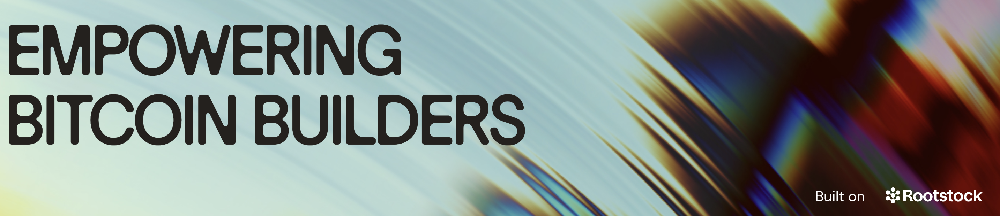
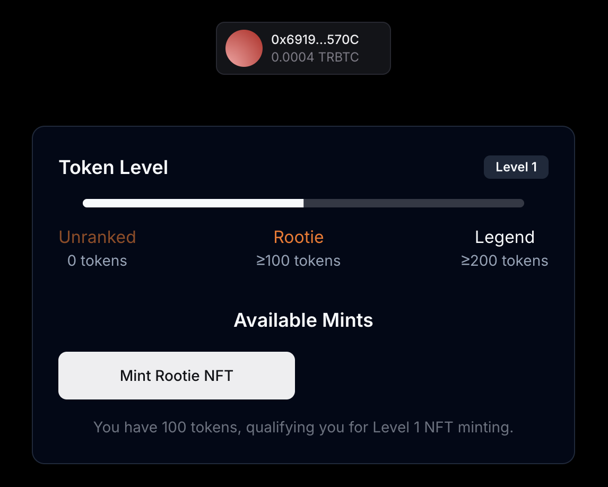

[](https://scorecard.dev/viewer/?uri=github.com/rsksmart/ootstock-collective-rewards)
[](https://github.com/rsksmart/rootstock-collective-rewardsh/actions?query=workflow%3ACodeQL)


<p align="center">
  
  
  <br>
</p>

The Rootstock Collective Rewards showcases a streamlined approach for creating token-gated platforms that enhance user engagement and reward participation.

The user experience begins with a simple wallet connection, which authenticates the user and sets up a secure session using JWT. This ensures both security and a smooth flow throughout the platform.

Next, the app checks the user’s balance of mock stRIF tokens, deployed via Thirdweb. Holding 100 stRIF tokens allows the user to mint a "Rootie NFT," unlocking exclusive access and perks. For those with 200 stRIF tokens, the platform grants access to the prestigious "Legend NFT," providing even more valuable rewards and opportunities.

<p align="center">
  <br><br>
  
  <br><br>
</p>

This approach emphasizes the power of token-based access and NFTs to build tiered, engaging ecosystems. It’s an efficient, flexible solution for web3 developers looking to create impactful, value-driven experiences that encourage deeper community interaction and reward loyalty.

## Features

- Web3 Wallet Integration (Social login)
- JWT Session Management
- Token-Gated Content
- NFT Minting System

## Tech Stack

- Next.js 14
- Thirdweb (sdk, auth, connection, UI)
- Tailwind CSS
- Shadcn/UI Components

## Contracts

Smart contracts are integrated via Thirdweb SDK:

- [stRIF](https://rootstock-testnet.blockscout.com/address/0xCacB5872A030d1a0Ca9267FA2AE87b4baE9D90fC)
- [Rootie NFT Contract](https://rootstock-testnet.blockscout.com/address/0x683AA67632c67d1Ff86FB475FC995E554E8E2AAd)
- [Legend NFT Contract](https://rootstock-testnet.blockscout.com/address/0xd013E82A3EE8882B011631F3C86c279559ab53bf)

## Thirdweb

## Project Structure

```
.
├── src
│   ├── app
│   │   ├── actions
│   │   │   ├── auth.ts         # Authentication actions
│   │   │   └── gate.ts         # Token gating logic
│   │   ├── favicon.ico
│   │   ├── globals.css
│   │   ├── layout.tsx
│   │   ├── page.tsx
│   │   └── utils
│   │       ├── client.ts       # Thirdweb client setup
│   │       ├── consts.ts       # Global constants as contracts and roostockTestnet chain declaration
│   │       └── thirdwebAuth.ts # Thirdweb auth client config
│   ├── components
│   │   ├── Footer.tsx
│   │   ├── Hero.tsx
│   │   ├── LoginButton.tsx     # LoginButton from thirdweb configured with the auth options for jwt session
│   │   ├── mint-section.tsx    # Gate logic implementation and minting
│   │   ├── token-progress.tsx  # Porgress bar for the balance of stRIF
│   │   └── ui                  # Shadcn UI components
│   │       ├── alert.tsx
│   │       ├── badge.tsx
│   │       ├── button.tsx
│   │       ├── progress.tsx
│   │       └── sonner.tsx
│   └── lib
│       ├── error.ts
│       ├── hooks.ts            # Custom hooks for the conditional rendering in mint-section.tsx
│       └── utils.ts            # Auth helpers for ./src/app/actions/auth.ts
├── tailwind.config.ts
└── tsconfig.json
```

## Setup

### Prerequisites

- Node.js v18+
- Bun package manager
- MetaMask or compatible Web3 wallet
- Thirdweb account

### Environment Variables

```bash
# Thirdweb Configuration
# Required: Client ID from thirdweb dashboard
# Get it from: https://thirdweb.com/dashboard/
NEXT_PUBLIC_TEMPLATE_CLIENT_ID=your_client_id_here

# Required: Secret key for server-side operations
# Get it from: https://thirdweb.com/dashboard/
# WARNING: Never expose this in client-side code or commit to version control
THIRDWEB_SECRET_KEY=your_secret_key_here

# Required: Domain for authentication
# Format: hostname:port
# Use localhost:3000 for local development
# Use your actual domain in production (e.g., myapp.com)
NEXT_PUBLIC_THIRDWEB_AUTH_DOMAIN=localhost:3000

# Required: Private key of the admin wallet
# Get it from: Your wallet's export private key option
# WARNING: Keep this secure and never share or commit this
# Used for: Contract deployments, admin operations
THIRDWEB_ADMIN_PRIVATE_KEY=your_private_key_here
```

### Installation

```bash
# Install dependencies
bun install

# Run development server
bun run dev
```

## Resources

- [Thirdweb Documentation](https://portal.thirdweb.com/)
- [Rootstock Documentation](https://developers.rsk.co/)
- [Rootstock Collective](https://rootstockcollective.xyz/)

## License

This project is licensed under the MIT License. See the LICENSE file for details.

## Contributing

1. Fork the repository
2. Create feature branch
3. Submit pull request

We welcome contributions from the community. Please fork the repository and submit pull requests with your changes. Ensure your code adheres to the project's main objective.

## Support

For any questions or support, please open an issue on the repository or reach out to the maintainers.

## Disclaimer

The software provided in this GitHub repository is offered "as is," without warranty of any kind, express or implied, including but not limited to the warranties of merchantability, fitness for a particular purpose, and non-infringement.

- **Testing:** The software has not undergone testing of any kind, and its functionality, accuracy, reliability, and suitability for any purpose are not guaranteed.
- **Use at Your Own Risk:** The user assumes all risks associated with the use of this software. The author(s) of this software shall not be held liable for any damages, including but not limited to direct, indirect, incidental, special, consequential, or punitive damages arising out of the use of or inability to use this software, even if advised of the possibility of such damages.
- **No Liability:** The author(s) of this software are not liable for any loss or damage, including without limitation, any loss of profits, business interruption, loss of information or data, or other pecuniary loss arising out of the use of or inability to use this software.
- **Sole Responsibility:** The user acknowledges that they are solely responsible for the outcome of the use of this software, including any decisions made or actions taken based on the software's output or functionality.
- **No Endorsement:** Mention of any specific product, service, or organization does not constitute or imply endorsement by the author(s) of this software.
- **Modification and Distribution:** This software may be modified and distributed under the terms of the license provided with the software. By modifying or distributing this software, you agree to be bound by the terms of the license.
- **Assumption of Risk:** By using this software, the user acknowledges and agrees that they have read, understood, and accepted the terms of this disclaimer and assumes all risks associated with the use of this software.
